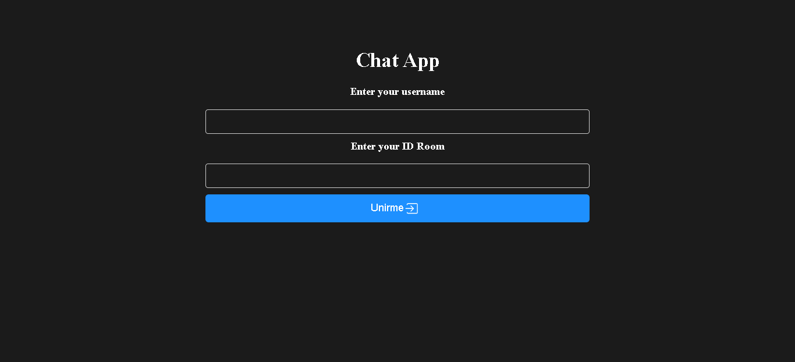
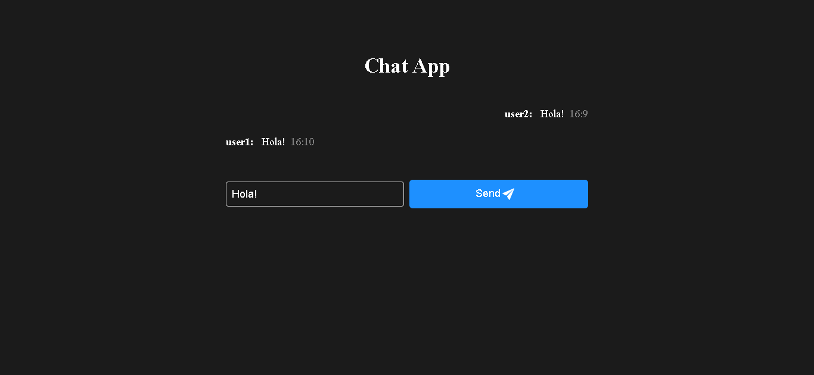

# Chat en Tiempo Real con React, Express y Socket.io

Este es un proyecto de chat en tiempo real que utiliza React en el frontend, Express.js en el backend y Socket.io para la comunicación bidireccional entre el cliente y el servidor.

## Instalación

1. Clona este repositorio en tu máquina local.
2. Navega hasta el directorio del proyecto en tu terminal.
3. Instala las dependencias del frontend y del backend:
    ```bash
    cd src
    cd client
    npm install
    cd ../backend
    npm install
    ```
4. Asegúrate de tener instalado Node.js, vite y npm.
5. Configura tu base de datos si es necesario (por ejemplo, MongoDB para almacenar mensajes).
6. Asegúrate de tener configurado el servidor de Socket.io en el backend.
7. Crear un archivo .env y asegurate de pasar  las variables de entorno correctas para acceder a la base de datos o al servidor

## Uso

1. Inicia el servidor backend:
    ```bash
    cd backend
    npm start o npm run devNode para modo desarrollo
    ```
2. Inicia el servidor frontend:
    ```bash
    cd frontend
    npm run dev
    ```
3. Abre tu navegador web y ve a `http://localhost:PORT` despues de iniciar el `http://localhost:PORT`, recuerda que es tu puerto a eleccion.

## Tecnologías Utilizadas

- **Frontend:**
    - React
    - Socket.io client
    - HTML
    - CSS (en esta ocasion)

- **Backend:**
    - Express.js
    - Socket.io
    - Node.js
    - No se uso base de datos (Usa mongodb opcional, para almacenar mensajes)

## Estado del Proyecto

Este proyecto está concluido, posible mejora de la interfaz.

### Imagenes de finalizacion
Imagen de inicio


Imagen de conversacion


## FAQ

### ¿Cómo puedo enviar un mensaje en el chat?
Escribe tu mensaje en el campo de entrada y presiona Enter o click al boton para enviarlo. El mensaje será enviado a todos los usuarios conectados en tiempo real.

### ¿Se almacenan los mensajes en una base de datos?
Depende de la configuración del proyecto. Puedes configurar una base de datos (por ejemplo, MongoDB) en el backend para almacenar los mensajes si lo deseas.
